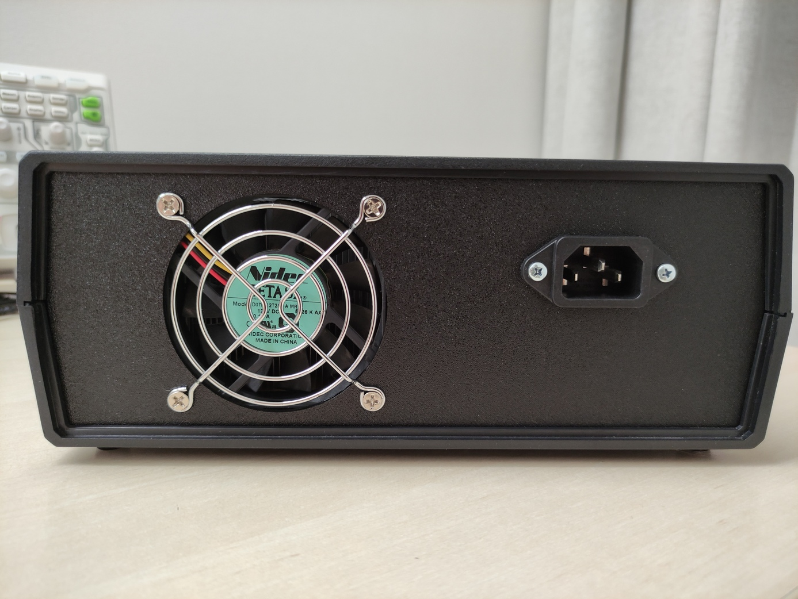

# Lab PSU

Linear power supply with 5 fixed outputs (+12V, +5V, +3.3V, -5V, -12V).

**Features:**

- 5 linear outputs: +12V, +5V, +3.3V, -5V, -12V
- Up to 1A of current for positive and negative rail
- Current indication on both rails
- Low noise (25mV peak-peak on negative rail, 15mV peak-peak on positive rail)
- Temperature controlled fan

**Assembly notes**

- Power supply case: Kradex Z17
- AC transformer: 40W toroid with 18V secondary
- Ammeters: 91C16 with [custom scale](./scale/91C16%20scale.svg) created using [Scale Master](https://soulmare.github.io/scale_master/)
- Cooling: CMDK8-7I52D-A5-GP or equivalent (70mm fan)
- [Schematic and PCB](./kicad) created using KiCad
- [Case panels](./panels) created using LibreCad
